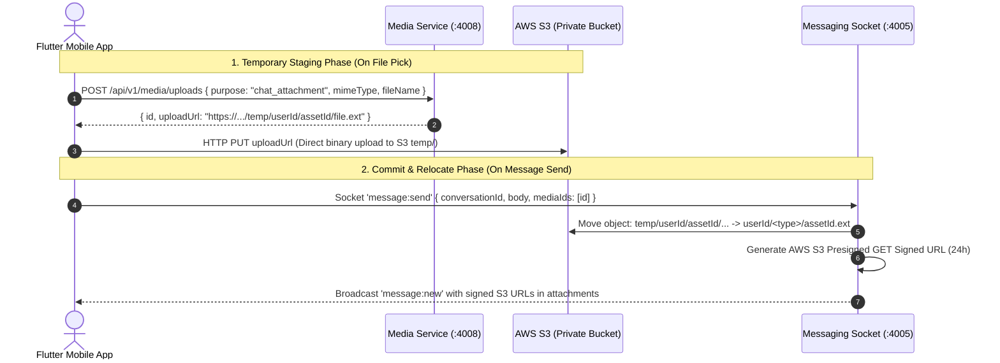

# 📱 XprtLink — Flutter WebSocket Chat Integration Guide

> **Single Source of Truth Real-Time Messaging & Media Attachments Specification for Flutter Mobile Engineers**

---

## 1. Minimal Architecture Overview



- **Protocol**: Socket.IO v4 (`socket_io_client: ^3.0.2` in Flutter)
- **Base Endpoint**: `ws://<HOST>:4000/socket.io` (via API Gateway) or direct `:4005`
- **S3 Bucket Privacy**: Fully private. All asset URLs delivered through Socket.IO and REST are securely signed with AWS Signature V4.
- **Room Strategy**:
  - `user:<userId>`: Automatically joined on connect for inbox updates & badge counters.
  - `conversation:<conversationId>`: Joined when opening a chat screen.

---

## 2. Flutter Dependencies (`pubspec.yaml`)

```yaml
dependencies:
  flutter:
    sdk: flutter
  socket_io_client: ^3.0.2
  http: ^1.2.0
```

---

## 3. Socket Connection & Authentication

```dart
import 'package:socket_io_client/socket_io_client.dart' as IO;

IO.Socket socket = IO.io(
  'http://<YOUR_GATEWAY_URL>:4000',
  IO.OptionBuilder()
      .setTransports(['websocket', 'polling'])
      .disableAutoConnect()
      .setAuth({'token': userAccessToken}) // Pass JWT Access Token
      .setExtraHeaders({'Authorization': 'Bearer $userAccessToken'})
      .build(),
);

// Lifecycle
socket.connect();
socket.onConnect((_) => print('Connected: ${socket.id}'));
socket.onDisconnect((reason) => print('Disconnected: $reason'));
socket.onConnectError((err) => print('Connect Error: $err'));
```

---

## 4. Client-to-Server Events (Emit & Acknowledgment)

All request events use **Socket.IO Acknowledgment Callbacks** for instant response and error handling.

### 1. `conversation:list` — Fetch User Threads
- **Direction**: Client &rarr; Server
- **Payload**:
  ```json
  {
    "page": 1,
    "limit": 20
  }
  ```
- **Acknowledgment Callback**:
  ```json
  {
    "success": true,
    "data": {
      "items": [
        {
          "id": "a6e13d67-1c28-4e73-a22f-c15ec9a2684b",
          "expertId": "5768b787-261d-4c16-8640-b0287a3227d9",
          "customerId": "4b8f282f-3016-41b8-98f7-1b967639b69c",
          "peerName": "Jordan Expert",
          "peerAvatarUrl": "https://...",
          "lastMessagePreview": "Hello, how can I help you?",
          "lastMessageAt": "2026-08-14T10:15:37.420Z",
          "unreadCount": 2
        }
      ],
      "pagination": { "page": 1, "limit": 20, "total": 1, "totalPages": 1 }
    }
  }
  ```

---

### 2. `conversation:create` — Start or Get Thread
- **Direction**: Client &rarr; Server
- **Payload** (pass `expertId` if customer, or `customerId` if expert):
  ```json
  {
    "expertId": "5768b787-261d-4c16-8640-b0287a3227d9"
  }
  ```
- **Acknowledgment Callback**:
  ```json
  {
    "success": true,
    "data": {
      "id": "a6e13d67-1c28-4e73-a22f-c15ec9a2684b",
      "expertId": "5768b787-261d-4c16-8640-b0287a3227d9",
      "customerId": "4b8f282f-3016-41b8-98f7-1b967639b69c",
      "peerName": "Jordan Expert",
      "peerAvatarUrl": null,
      "lastMessagePreview": null,
      "lastMessageAt": null,
      "unreadCount": 0
    }
  }
  ```

---

### 3. `conversation:join` — Join Chat Room
Call this whenever navigating to the chat conversation screen.
- **Direction**: Client &rarr; Server
- **Payload**:
  ```json
  {
    "conversationId": "a6e13d67-1c28-4e73-a22f-c15ec9a2684b"
  }
  ```
- **Acknowledgment**: `{ "success": true, "data": { "conversationId": "...", "joined": true } }`

---

### 4. `conversation:leave` — Leave Chat Room
Call this when popping/exiting the conversation screen.
- **Direction**: Client &rarr; Server
- **Payload**:
  ```json
  {
    "conversationId": "a6e13d67-1c28-4e73-a22f-c15ec9a2684b"
  }
  ```

---

### 5. `message:history` — Load Paginated Messages
- **Direction**: Client &rarr; Server
- **Payload**:
  ```json
  {
    "conversationId": "a6e13d67-1c28-4e73-a22f-c15ec9a2684b",
    "page": 1,
    "limit": 50
  }
  ```
- **Acknowledgment Callback**:
  ```json
  {
    "success": true,
    "data": {
      "items": [
        {
          "id": "8308689d-88be-4742-86cf-bbeb0c1d2b4c",
          "conversationId": "a6e13d67-1c28-4e73-a22f-c15ec9a2684b",
          "senderUserId": "c717f6e4-104f-4ade-b3c3-5d157cb306d3",
          "body": "Here is the project specification document.",
          "type": "attachment",
          "deliveryStatus": "sent",
          "attachments": [
            {
              "mediaId": "f2ff2731-e61e-4892-aa23-358bec791f43",
              "url": "http://localhost:4000/api/v1/media/files/.../doc.pdf",
              "mimeType": "application/pdf",
              "sizeBytes": 245120,
              "purpose": "chat_attachment"
            }
          ],
          "createdAt": "2026-08-14T10:15:37.420Z"
        }
      ],
      "pagination": { "page": 1, "limit": 50, "total": 1, "totalPages": 1 }
    }
  }
  ```

---

### 6. `message:send` — Send Message (Text & Media Attachments)
- **Direction**: Client &rarr; Server
- **Payload**:
  ```json
  {
    "conversationId": "a6e13d67-1c28-4e73-a22f-c15ec9a2684b",
    "body": "Hello Jordan, here is my report",
    "mediaIds": ["f2ff2731-e61e-4892-aa23-358bec791f43"]
  }
  ```
- **Acknowledgment**:
  ```json
  {
    "success": true,
    "data": {
      "id": "new-message-uuid",
      "conversationId": "...",
      "senderUserId": "...",
      "body": "Hello Jordan...",
      "type": "attachment",
      "deliveryStatus": "sent",
      "attachments": [...],
      "createdAt": "2026-08-14T10:15:37.420Z"
    }
  }
  ```

---

### 7. `message:read` — Mark Conversation Read
- **Direction**: Client &rarr; Server
- **Payload**:
  ```json
  {
    "conversationId": "a6e13d67-1c28-4e73-a22f-c15ec9a2684b"
  }
  ```
- **Acknowledgment**: `{ "success": true, "data": { "read": true, "unreadCount": 0 } }`

---

### 8. Typing Indicators (`typing:start` & `typing:stop`)
- **Direction**: Client &rarr; Server
- **Payload**:
  ```json
  {
    "conversationId": "a6e13d67-1c28-4e73-a22f-c15ec9a2684b"
  }
  ```

---

## 5. Server-to-Client Real-Time Listeners

Listen to these events inside Flutter:

| Event Name | Scope | Payload Description | Flutter Action |
| :--- | :--- | :--- | :--- |
| **`message:new`** | Conversation Room | `{ "conversationId": "...", "message": { ...MessageDTO } }` | Append message to active chat bubble list and scroll to bottom. |
| **`conversation:read`** | Conversation Room | `{ "conversationId": "...", "userId": "...", "readAt": "..." }` | Update message checkmark icons to double tick / "Read". |
| **`typing:status`** | Conversation Room | `{ "conversationId": "...", "userId": "...", "isTyping": true/false }` | Show/hide *"Jordan is typing..."* indicator. |
| **`conversation:updated`**| User Room (`user:<id>`) | `{ "conversationId": "...", "lastMessage": { ... }, "senderUserId": "..." }` | Update conversation list tile and increment unread badge counter. |
| **`conversation:new`** | User Room (`user:<id>`) | `{ "conversation": { ...ConversationSummary } }` | Insert new thread to top of inbox list. |

---

## 6. Media Attachment Upload (Document, Image, Video)

Attachments are uploaded to the Media Service before emitting `message:send`:

### 1. Dynamic Config Endpoint (`GET /api/v1/media/config/attachments`)
Returns the `.env` configured formats and max size limits:
```json
{
  "success": true,
  "data": {
    "image": {
      "mimes": ["image/jpeg", "image/png", "image/webp", "image/gif", "image/heic"],
      "maxSizeMb": 10
    },
    "document": {
      "mimes": ["application/pdf", "application/msword", "application/vnd.openxmlformats-officedocument.wordprocessingml.document", "text/plain", "text/csv"],
      "maxSizeMb": 15
    },
    "video": {
      "mimes": ["video/mp4", "video/quicktime", "video/webm", "video/x-matroska", "video/3gpp"],
      "maxSizeMb": 50
    }
  }
}
```

### 2. S3 Presigned Upload Request (`POST /api/v1/media/uploads`)
- **Headers**:
  - `Content-Type: application/json`
  - `Authorization: Bearer <JWT>`
- **Request Body**:
  ```json
  {
    "purpose": "chat_attachment",
    "mimeType": "image/jpeg",
    "fileName": "photo.jpg",
    "sizeBytes": 204800
  }
  ```
- **Response**:
  ```json
  {
    "success": true,
    "message": "Upload created",
    "data": {
      "id": "f2ff2731-e61e-4892-aa23-358bec791f43",
      "uploadUrl": "https://xprtlink-static.s3.us-west-2.amazonaws.com/temp/userId/f2ff2731.../photo.jpg?X-Amz-...",
      "purpose": "chat_attachment",
      "mimeType": "image/jpeg",
      "sizeBytes": 204800,
      "status": "pending_upload"
    }
  }
  ```

### 3. Binary Upload Direct to S3 (`PUT <uploadUrl>`)
In Flutter, perform a direct HTTP PUT of the file bytes to `data.uploadUrl`:
```dart
final response = await http.put(
  Uri.parse(uploadUrl),
  headers: {'Content-Type': mimeType},
  body: fileBytes,
);
```

### 4. Emit `message:send` with `mediaIds`
Pass `data.id` in `mediaIds: ["f2ff2731-e61e-4892-aa23-358bec791f43"]` via Socket.IO `message:send`. The backend will automatically relocate the file from `temp/` to permanent S3 storage and broadcast signed URLs.

---

## 7. Ready-to-Use Flutter Service (`ChatSocketService.dart`)

```dart
import 'dart:async';
import 'package:socket_io_client/socket_io_client.dart' as IO;

class ChatSocketService {
  static final ChatSocketService _instance = ChatSocketService._internal();
  factory ChatSocketService() => _instance;
  ChatSocketService._internal();

  IO.Socket? _socket;

  // Streams for UI Reactive State
  final _messageController = StreamController<Map<String, dynamic>>.broadcast();
  final _typingController = StreamController<Map<String, dynamic>>.broadcast();
  final _readController = StreamController<Map<String, dynamic>>.broadcast();
  final _inboxUpdateController = StreamController<Map<String, dynamic>>.broadcast();

  Stream<Map<String, dynamic>> get onNewMessage => _messageController.stream;
  Stream<Map<String, dynamic>> get onTypingStatus => _typingController.stream;
  Stream<Map<String, dynamic>> get onConversationRead => _readController.stream;
  Stream<Map<String, dynamic>> get onInboxUpdated => _inboxUpdateController.stream;

  void init(String gatewayUrl, String token) {
    if (_socket != null && _socket!.connected) return;

    _socket = IO.io(
      gatewayUrl,
      IO.OptionBuilder()
          .setTransports(['websocket', 'polling'])
          .disableAutoConnect()
          .setAuth({'token': token})
          .setExtraHeaders({'Authorization': 'Bearer $token'})
          .build(),
    );

    _socket!.onConnect((_) => print('🟢 Socket connected'));
    _socket!.onDisconnect((reason) => print('🔴 Socket disconnected: $reason'));

    // Register Listeners
    _socket!.on('message:new', (data) => _messageController.add(Map<String, dynamic>.from(data)));
    _socket!.on('typing:status', (data) => _typingController.add(Map<String, dynamic>.from(data)));
    _socket!.on('conversation:read', (data) => _readController.add(Map<String, dynamic>.from(data)));
    _socket!.on('conversation:updated', (data) => _inboxUpdateController.add(Map<String, dynamic>.from(data)));

    _socket!.connect();
  }

  // Emitters with Futures
  Future<List<dynamic>> fetchConversations({int page = 1, int limit = 20}) {
    final completer = Completer<List<dynamic>>();
    _socket?.emitWithAck('conversation:list', {'page': page, 'limit': limit}, ack: (res) {
      if (res['success'] == true) {
        completer.complete(res['data']['items'] ?? []);
      } else {
        completer.completeError(res['message'] ?? 'Failed to list conversations');
      }
    });
    return completer.future;
  }

  void joinConversation(String conversationId) {
    _socket?.emit('conversation:join', {'conversationId': conversationId});
  }

  void leaveConversation(String conversationId) {
    _socket?.emit('conversation:leave', {'conversationId': conversationId});
  }

  Future<Map<String, dynamic>> sendMessage({
    required String conversationId,
    String? body,
    List<String>? mediaIds,
  }) {
    final completer = Completer<Map<String, dynamic>>();
    _socket?.emitWithAck(
      'message:send',
      {'conversationId': conversationId, 'body': body, 'mediaIds': mediaIds ?? []},
      ack: (res) {
        if (res['success'] == true) {
          completer.complete(Map<String, dynamic>.from(res['data']));
        } else {
          completer.completeError(res['message'] ?? 'Send failed');
        }
      },
    );
    return completer.future;
  }

  // Attachment Upload: Request S3 Presigned URL & Direct Binary PUT
  Future<String> uploadAttachmentToS3({
    required String gatewayUrl,
    required String token,
    required String fileName,
    required String mimeType,
    required List<int> fileBytes,
  }) async {
    // 1. Request presigned PUT URL
    final presignUri = Uri.parse('$gatewayUrl/api/v1/media/uploads');
    final presignRes = await http.post(
      presignUri,
      headers: {
        'Content-Type': 'application/json',
        'Authorization': 'Bearer $token',
      },
      body: jsonEncode({
        'purpose': 'chat_attachment',
        'mimeType': mimeType,
        'fileName': fileName,
        'sizeBytes': fileBytes.length,
      }),
    );

    final presignData = jsonDecode(presignRes.body);
    if (presignRes.statusCode != 201 || presignData['success'] != true) {
      throw Exception(presignData['message'] ?? 'Failed to request S3 upload URL');
    }

    final String mediaId = presignData['data']['id'];
    final String uploadUrl = presignData['data']['uploadUrl'];

    // 2. HTTP PUT direct to S3
    final s3Res = await http.put(
      Uri.parse(uploadUrl),
      headers: {'Content-Type': mimeType},
      body: fileBytes,
    );

    if (s3Res.statusCode < 200 || s3Res.statusCode >= 300) {
      throw Exception('S3 binary upload failed with status ${s3Res.statusCode}');
    }

    return mediaId;
  }

  void markAsRead(String conversationId) {
    _socket?.emit('message:read', {'conversationId': conversationId});
  }

  void sendTyping(String conversationId, bool isTyping) {
    _socket?.emit(isTyping ? 'typing:start' : 'typing:stop', {'conversationId': conversationId});
  }

  void dispose() {
    _socket?.disconnect();
    _socket?.dispose();
    _messageController.close();
    _typingController.close();
    _readController.close();
    _inboxUpdateController.close();
  }
}
```
